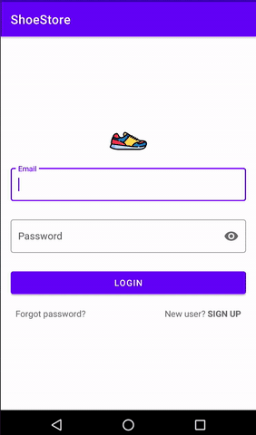

# Shoe Store

First project of the [Android Kotlin Developer Nanodegree course](https://www.udacity.com/course/android-kotlin-developer-nanodegree--nd940).

## Getting Started

Download the project from [Github](https://github.com/RicardoBravoA/ShoeStore), the updated branch is **master**

### Dependencies

This project uses the following dependencies

- [ConstraintLayout](https://developer.android.com/training/constraint-layout)
- [scrollingpagerindicator](https://developer.android.com/guide/navigation/navigation-getting-started)
- [ScrollingPagerIndicator](https://github.com/TinkoffCreditSystems/ScrollingPagerIndicator)


### Installation

For now it has 2 environments.

```
debug
release
```

## Testing

For now there are no tests.

## Project Instructions

The project has this features.

<p align="center">
  <br>
</p>

- Login
	- Includes email and password validations
	- Once logged in, you cannot return to this screen
- Walkthrough
	- ViewPager with 2 fragments, navigation button and a menu to log out and return to login
	- You cannot return to this screen
	- Shows logout menu, which returns to login
- List
	- Recycler view that shows the list of items
	- The recycler view item show images and includes an indicator
	- In case the user does not select an image, one is loaded by default
	- Shows logout menu, which returns to login
- Detail
	- Allows to enter name, description, company, size and images
	- You can select multiple images or none
	- Shows logout menu, which returns to login

## License

    Copyright 2020 Ricardo Bravo (Woz).

    Licensed under the Apache License, Version 2.0 (the "License");
    you may not use this file except in compliance with the License.
    You may obtain a copy of the License at

       http://www.apache.org/licenses/LICENSE-2.0

    Unless required by applicable law or agreed to in writing, software
    distributed under the License is distributed on an "AS IS" BASIS,
    WITHOUT WARRANTIES OR CONDITIONS OF ANY KIND, either express or implied.
    See the License for the specific language governing permissions and
    limitations under the License.